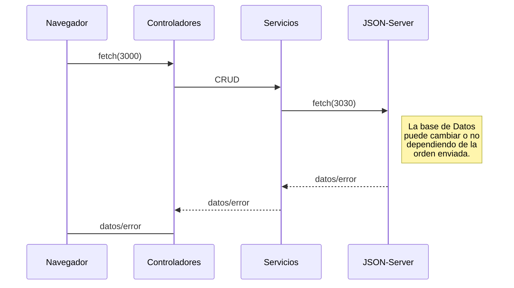

# Trabajo Practico Grupal Final 3er Cuatrimestre
<p  align="center">
<b>LINK a documentacion de Proyecto: &nbsp; <b>
<a  href="https://docs.google.com/document/d/1j0ti10-tqTuczG9UcJh1Gl8E4VVyU6ljgZRkvX3FUMU/"  target="blank"></a>
</p>

 ## Description:
Crear una api utilizando el framework [Nest](https://github.com/nestjs/nest).  <a href="http://nestjs.com/" target="blank"></a>

## Grupo de Trabajo:
- Banchi Agustin 
- Lacave Tomas
- Mansilla Nicolas
- Patronelli Mario

 ## Consigna:
##### 📆 Fecha Limite martes 05-09-2023 ✅
 - [x] Crear el proyecto utilizando [Nest](https://github.com/nestjs/nest)
 - [x] Armar modelos de datos, simular una petición y su consiguiente respuesta del backend 
 - [x] Montar Base de datos de prueba, conectarla con la API tener un servicio con una petición y su respuesta (datos obtenidos de la DB) GET-GET BylD 
 - [x] Obtener la respuesta de la petición utilizando [POSTMAN](https://www.postman.com/)
 - [x] Crear los endpoints necesarios de ALTA para nuestra API utilizando métodos POST 
##### 📆 Fecha Limite lunes 18-09-2023 
 - [ ] Crear los endpoints necesarios de BAJA Y MODIFICACIONES para nuestra API utilizando métodos PUT Y DELET 
 - [ ] A todos los endpoints previamente creados agregarle los codigos de respuesta utilizando el decorador @Res 
 - [ ] Agregar excepciones a todos los endpoints previamente creados 
 - [ ] Agregar módulos y validaciones 
 - [ ] Crear y agregar DTOS al proyecto y validaciones

#### 📆 Fecha Limite de entrega y demo del martes 19-09-2023 al jueves 21-09-2029 ❗

### paquetes utilizados:
en Node.js :
```bash
$ npm install -g json-server
$ npm i --save @nestjs/serve-static
$ npm i --save class-validator class-transformer
```
<!-- 
npm i ts-node // para no crear *.JS
-->
### Fuentes
- [json-server](https://www.npmjs.com/package/json-server)
- [@nestjs/serve-static](https://www.npmjs.com/package/@nestjs/serve-static)
- [class-validator](https://www.npmjs.com/package/class-validator)

### Como ejecutarlo ?
en Node.js:
para ejecutar el programa, primero instalar las dependencias, despues ejecutar:
```bash
git clone https://github.com/agubanchi/abrancancha_backend.git
cd abrancancha_backend
npm install
npm run db
npm run start (en otra terminal)
```
### Flujo de la aplicación
